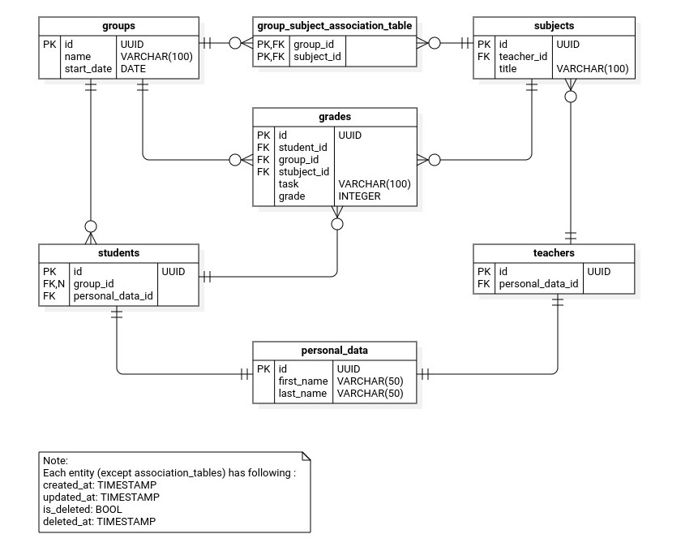

# Fullstack Web Development with Python <!-- omit in toc -->

### [# goit-pythonweb-hw-06](https://github.com/topics/goit-pythonweb-hw-06) <!-- omit in toc -->

<p align="center">
  
</p>

## Database Management with SQLAlchemy & PostgreSQL <!-- omit in toc -->

This project demonstrates the use of **SQLAlchemy ORM for modeling** relational **data in PostgreSQL**, along with **Alembic for schema migrations**, **Faker for generating test data**, and a **Python CLI (via argparse) for performing CRUD operations** on the database.

The app simulates an academic environment with students, teachers, groups, subjects, and grades.

<p align="center">
  
</p>

Main features:

* SQLAlchemy-based data modeling for Students, Teachers, Groups, Subjects, and Grades.
* Alembic integration for database versioning and migrations.
* Faker-powered data seeding with realistic student records and grades.
* A command-line interface for managing database records with create, list, update, and remove actions.
* SQL queries implemented via ORM: top students, average grades, group statistics, and more.

## Table of Contents <!-- omit in toc -->
- [Task Requirements](#task-requirements)
  - [Technical Description](#technical-description)
    - [Technical Steps](#technical-steps)
      - [Step 1 - SQLAlchemy Models](#step-1---sqlalchemy-models)
      - [Step 2 - Alembic Migrations](#step-2---alembic-migrations)
      - [Step 3 - Data Seeding with Faker](#step-3---data-seeding-with-faker)
      - [Step 4 - ORM Queries](#step-4---orm-queries)
    - [Optional Tasks](#optional-tasks)
      - [Part 1 - More Complex Queries](#part-1---more-complex-queries)
      - [Part 2 - CLI for CRUD Operations](#part-2---cli-for-crud-operations)
- [Task Solution](#task-solution)
  - [Solution Description](#solution-description)
  - [Features](#features)
  - [Project Files Structure](#project-files-structure)
  - [Solution Screenshots](#solution-screenshots)
- [Project Setup \& Run Instructions](#project-setup--run-instructions)
  - [Prerequisites](#prerequisites)
  - [Setting Up the Development Environment](#setting-up-the-development-environment)
    - [1. Clone the Repository and Install Dependencies](#1-clone-the-repository-and-install-dependencies)
    - [2. Setup database](#2-setup-database)
    - [3. Setup application connection to database](#3-setup-application-connection-to-database)
    - [4. Migrate and synchronize database with ORM](#4-migrate-and-synchronize-database-with-orm)
    - [5. Seed database with fake data](#5-seed-database-with-fake-data)
    - [6. Execute queries to get data](#6-execute-queries-to-get-data)
    - [7. ...](#7-)
- [License](#license)

## Task Requirements

This project implements a database schema using `PostgreSQL` and `SQLAlchemy`, along with `Alembic` for migrations, `Faker` for data seeding, and a `CLI` interface for CRUD operations.

### Technical Description

Implement database that includes following tables:

* Students table;
* Groups table;
* Teachers table;
* Subjects table with a reference to the teacher who teaches the subject;
* Table, where each student has grades for subjects, along with the date the grade was received.

Use `postgres` database. Run the PostgreSQL database using Docker:

```bash
docker run --name some-postgres -p 5432:5432 -e POSTGRES_PASSWORD=mysecretpassword -d postgres
```

Replace container name `some-postgres` and password `mysecretpassword` with your custom values to connect to the database.

#### Technical Steps

##### Step 1 - SQLAlchemy Models

Implement SQLAlchemy models for the following tables:

* Students table
* Groups table
* Teachers table
* Subjects  table(with a foreign key to the teacher who teaches the subject)
* Table with Grades (with a foreign key to student and subject, and a timestamp for when the grade was assigned)

##### Step 2 - Alembic Migrations

Use `Alembic` to create database migrations and apply them to your PostgreSQL database.

##### Step 3 - Data Seeding with Faker

Create a script `seed.py` that populates the database with realistic random data:

* ~30-50 students
* 3 groups
* 5-8 subjects
* 3-5 teachers
* Up to 20 grades per student across all subjects

Use **SQLAlchemy** sessions and the **Faker** library for generating data.

##### Step 4 - ORM Queries

Implement the following 10 SQL queries using **SQLAlchemy** ORM:

1. Retrieve the top 5 students with the highest average grade across all subjects.
2. Find the student with the highest average grade in a specific subject.
3. Find the average grade per group for a specific subject.
4. Find the overall average grade across all grades for cohort students.
5. Find which subjects are taught by a specific teacher.
6. Retrieve a list of students in a specific group.
7. Retrieve the grades of students in a specific group for a specific subject.
8. Find the average grade a specific teacher gives across their subjects.
9. List the courses taken by a specific student.
10. List the courses a specific teacher teaches to a specific student.

Use `SQLAlchemy` sessions to perform all queries.
Organize them into a file `my_select.py`, each as a function from `select_1()` to `select_10()`.

#### Optional Tasks

These tasks are optional and not required to pass the assignment.

##### Part 1 - More Complex Queries

1. Find the average grade a specific teacher gives to a specific student.
2. Retrieve grades from the last lesson for students in a specific group and subject.

##### Part 2 - CLI for CRUD Operations

Instead of using `seed.py`, create a **full-featured CLI application** using the `argparse` module to perform **CRUD** operations on all models.

Use the following command structure:

* `--action` (or `-a`) for specifying the action (`create`, `list`, `update`, `remove`)
* `--model` (or `-m`) for specifying the target model (e.g. `Teacher`, `Group`, etc.)

**Commands structure**:

* Create a teacher:
  ```bash
  -action create -m Teacher --name 'Boris Jonson'
  ```
* List all teachers:
  ```bash
  -action list -m Teacher
  ```
* Update a teacher's data with `id=3`:
  ```bash
  -action update -m Teacher --id 3 --name 'Andry Bezos'
  ```

Implement similar commands for all models.

**Examples of commands in terminal**:

* Create a teacher
  ```bash
  py main.py -a create -m Teacher -n 'Boris Jonson'
  ```
* Create a group
  ```bash
  py main.py -a create -m Group -n 'AD-101'
  ```

## Task Solution

### Solution Description

As a solution to the technical requirements, I created an app that simulates an academic environment with students, teachers, groups, subjects, and grades.

The application covers the following steps:

1. **Database Modeling** - Defined models using SQLAlchemy to represent all required entities and their relationships:
    * `Base` - Base class for all SQLAlchemy models with shared metadata.
    * `BaseModel` - Abstract base class for all models in the system to have common behavior (inherited from `Base` class and UUIDMixin, TimestampMixin, SoftDeleteMixin).
      * `UUIDMixin` - Adds a UUID primary key `id` field..
      * `TimestampMixin` - Adds `created_at` and `updated_at` timestamp fields.
      * `SoftDeleteMixin` - Adds soft-delete fields: `is_deleted` and `deleted_at`.
    * `Student` - Represents a student with a reference to their assigned group.
    * `Group` - Represents a students group.
    * `Teacher` - Represents a teacher with a reference to their assigned subject.
    * `Subject` - Represents a subject to study.
    * `Grade` - Represents a grade for a student, tied to a group, subject, and specific task. Allows multiple grades per subject if tied to different tasks.
2. **Migrations with Alembic** - Set up Alembic to manage database schema changes and apply them to a PostgreSQL instance.
    
3. **Data Seeding** - Created a `seed.py` script to populate the database with realistic, randomly generated data using the Faker library.
4. **Advanced Queries** - Implemented 10 SQL queries using SQLAlchemy ORM to extract meaningful insights, such as top-performing students, course averages, and teacher-specific statistics.
5. **CLI Interface** - Developed a command-line tool using `argparse` to perform CRUD operations on each model, allowing creation, listing, updating, and deletion of records via terminal commands.

### Features

- ...

### Project Files Structure
```
.
├── compose.yaml                # Docker Compose file
├── Dockerfile                  # Docker image definition
├── .dockerignore               # Files/folders to exclude from Docker context
├── pyproject.toml              # Project dependencies and config (Poetry)
└── src/
    ├── main.py                 # Entry point for the application
    ├── decorators/
    │   └── handle_server_errors.py   # Decorator to catch and handle server errors
    ├── storage/
...
```

### Solution Screenshots

**CRUD operations on each model**:


## Project Setup & Run Instructions

This guide will help you set up the environment and run the project.

### Prerequisites

Before you begin, make sure you have the following installed:

* **[Python 3.11.*](https://www.python.org/downloads/)** (tested with Python 3.11.13) — Required to run the application locally (outside Docker, if needed).
* **[Poetry](https://python-poetry.org/)** - To manage dependencies in virtual environment.
* **[Docker](https://www.docker.com/) using PostgreSQL 13+ with pgcrypto"** — Used to containerize the application in a unified environment using Docker or Docker Compose.
* **[psycopg2-binary](https://pypi.org/project/psycopg2/)** - PostgreSQL database adapter for the Python programming language (on Linux may require installation of additional packages `sudo apt install libpg-dev python3-dev`).
* (*Optional - for local development*) **[Git](https://git-scm.com/downloads)** — To clone [the repository](https://github.com/oleksandr-romashko/goit-pythonweb-hw-03), version control and development.
* (*Optional - for local development*) **[VS Code](https://code.visualstudio.com/download)** or another IDE — Recommended for browsing and editing the project source code and overall development.

### Setting Up the Development Environment

#### 1. Clone the Repository and Install Dependencies

1. Clone repository:
    ```bash
    git clone https://github.com/oleksandr-romashko/goit-pythonweb-hw-06
    cd goit-pythonweb-hw-06
    ```
    or download the ZIP archive from [GitHub Repository](https://github.com/oleksandr-romashko/goit-pythonweb-hw-06) and extract it.
2. Install project dependencies:
    ```bash
    poetry install
    ```

#### 2. Setup database

Dada are stored in Postgres database. To easily setup our own one for testing purposes we may use Docker.

To create Postgres database in Docker container use following command:

```bash
docker run --name pg-db-pythonweb-hw-06 -e POSTGRES_USER=app_user -e POSTGRES_PASSWORD=mysecretpassword -e POSTGRES_DB=lms_db -p 5432:5432 -d postgres
```

where:
- `pg-db-pythonweb-hw-06` - name of Docker container (you may set your own container name)
- `app_user` - username, setup with admin privileges
- `mysecretpassword` - password for the user (create your own one)
- `lms_db` - database name to connect to
- `5432:5432` - external/internal container port to access postgres database
- `postgres` - image name to base our container on (`postgres` in our case)

#### 3. Setup application connection to database

For app to access data in database we need correctly setup connection configuration. There is [config.ini.example](./config.ini.example) serves as a template for that:
```ini
[DB]
USER=app_user
PASSWORD=
HOST=localhost
PORT=5432
DB_NAME=lms_db
```

Make a copy of `config.ini.example` and rename it to `config.ini` (it should be located in project root directory).

Then in `config.ini` add password and change values with your own, if necessary. Values should correspond to values used to setup Postgres database in Docker container, otherwise application won't be able to connect to the database.

Now our app should be setup to connect to our database in Docker container.

#### 4. Migrate and synchronize database with ORM

As soon as we may connect to database we may perform queries. But our database has no tables or structure that conform to one set in ORM yet.

To comply our database with expected structure, execute following command:

```bash
poetry run alembic upgrade head
```

This will add tables with columns to database, that respect latest ORM structure.

**Other useful Alembic commands**:

* `poetry run alembic downgrade base` - downgrade database to basic state
* `poetry run alembic revision --autogenerate -m "revision message"` - automatically create new migration script
* `poetry run alembic history` - show migrations history
* `poetry run alembic current` - show current revision hash (useful to locate position in entire history)
* `poetry run alembic upgrade <revision hash>` - upgrade to certain revision
* `poetry run alembic downgrade <revision hash>` - downgrade to certain revision
* `poetry run alembic downgrade -1` - downgrade to the previous revision

#### 5. Seed database with fake data

At this stage we have empty tables with no data.

To see results of following queries in the next steps, let's add some fake (still relevant) data to database:

```bash
poetry run python ./src/scripts/seed.py [--dry-run] [--seed <value>]
```
You may add following additional flags to the command:
* `--dry-run` - Run the script without saving or modifying any data in database (see summary of the generated data).
* `--seed <value>` - Set a seed for the random number generator for reproducibility.

This will seed database with random data using `Faker` package.

#### 6. Execute queries to get data

According to task requirements we need to perform 10 queries, located in: `path to script file`.

#### 7. ...

## License

This project is licensed under the [MIT License](./LICENSE).
You are free to use, modify, and distribute this software in accordance with the terms of the license.